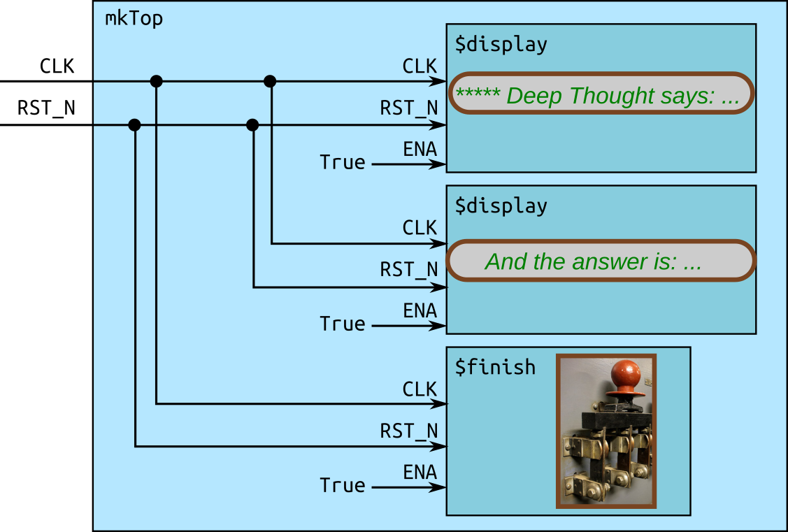

https://github.com/rsnikhil/ICFP2020_Bluespec_Tutorial

# 3. Introduction

# 4. Limbering up: "Hello World"

bluespec的设计有很多参考haskell的地方，不过有既视感是一回事，实际语义另说。

```haskell
mkTop :: Module Empty
mkTop =
  module
    rules
      "rl_print_answer": when True ==> do
          $display "\n\n***** Deep Thought says: Hello, World! *****"
          $display "      And the answer is: %0d (or, in hex: 0x%0h)\n"  42  42
          $finish
```

`Module t`类型表示一个硬件对象生成器 - 它可以被"实例化"多次，要创建模块，使用`module`关键字。`module`关键字的作用域内可以包含子模块，规则和接口。(在这个例子中只有一条规则)

`rules`关键字可以引入一到多条规则。每个规则由一个条件表达式(`Bool`类型)与一系列动作(其整体组合结果的类型为`Action`)组成，条件表达式对应电路的使能信号。

> When a rule fires, all its Actions are performed "`simultaneously`" and "`instantaneously`"
> (there is no temporal ordering amongst the Actions in a rule).
> 没太懂，这段说同一条规则里的action可以看成是并行的，没有时序关系

bsc支持编译为二进制文件模拟运行效果，使用`-sim`参数即可。

虽然使用bluespec的目的是避开枯燥的细节，但出于实际需要还是应该对生成的电路什么样有一些直觉上的认识。



可以看到每个Action都有`RST_N`和`CLK`俩个输入信号，时钟数字电路模块通常都有这玩意，`RST_N`(reset)一般只在一开始激活一次，让各器件处于一个确定的状态，通常它是反着来的(低电平激活，行话好像叫assert)。时钟信号用于约束其他信号的稳定性，它会在0和1之间来回振荡，转换过程通常称为上升沿(posedge)和下降沿(negedge).

所有的动作在概念上都在某个上升/下降沿(clock edge)执行.

除了直接编译出二进制进行模拟，bsc也可以编译出verilog用于模拟。

`Module t`这个类型中的`t`实际上是一个接口(interface)，它定义了环境与这个模块交互的方式，前文的`Empty`是一个预定义的无方法接口。

```haskell
interface DeepThought_IFC =
    getAnswer :: ActionValue (Int 32)
```

`ActionValue (Int 32)`是一个monadic的类型，它是带值的`Action`，从直觉上看对应硬件模块的某个输出信号。

现在试着实现一个具有`DeepThought_IFC`接口的模块

```haskell
-- DeepThought.bs
mkDeepThought :: Module DeepThought_IFC
mkDeepThought =
  module
    interface DeepThought_IFC
        getAnswer = return 42
```

module这个词在bluespec中已经被占用，而与haskell中的module概念相对的是package

```haskell
-- DeepThought.bs
package DeepThought where
```

使用方式仍然是import

```haskell
-- Top.bs
import DeepThought
```

一个文件只能包含一个package，并且需要和package同名 - 也因此bsc搜索package的实现方式很简单，就是直接在package名后加扩展名搜索

模块实例化与方法调用就像在haskell里使用do notation一样

```haskell
mkTop =
  module
    deepThought <- mkDeepThought    -- 模块实例化
    rules
        "rl_print_answer": when True ==> do
            x <- deepThought.getAnswer -- 在硬件对象上调用方法
            $display "\n\n***** Deep Thought says: Hello, World! *****"
            $display "      And the answer is: %0d (or, in hex: 0x%0h)\n"  x  x
            $finish
```

**注**: module monad实际上是通过`IsModule`这个typeclass定义的，这样就可以在module关键字里面弄点自定义内容，比如收集trace输出或者收集控制与状态寄存器啥的(For example, you can collect `trace` output to be captured in modules deep in the module hierarchcy and streamed out to be recorded somewhere.  Or you could collect "`control and status`" registers from deep within the module hierarchy, for dynamic configuration and monitoring of a hardware design.)

因为bluespec对module这一概念的使用和verilog很相似，可以用一条编译器指示让bsc在编译到verilog时维护原本的模块边界不做内联，这样会生成模块层级以及使用方式一致的verilog代码

```haskell
{-# verilog mkDeepThought #-}
```

**注**: 也不是啥模块都能用这个，因为bluespec作为能写电路的haskell，它的接口可以传递多态值(polymorphic values)和高阶函数, verilog的接口是飞线的(一根线是wire，一组线就buses)，只能传很具体的东西(bit 表示)。

下面看看使用寄存器的带状态程序怎么写，bluespec的寄存器用`Reg t`类型表示，这也是个接口，它有这样两个方法

```haskekll
_read  :: Reg t -> t
_write :: Reg t -> t -> Action
```

作用一目了然，给个例子便懂了

```haskell
rg_half_millenia._write (rg_half_millenia._read + 1)
```

不过这样write不好写，所以bluespec提供了一个语法糖

```haskell
rg_half_millenia := rg_half_millenia + 1
```

要创建寄存器也简单

```haskell
mkReg :: t -> Module (Reg t)
```

是的，bluespec的寄存器是泛型的 - 但是对外的提供的接口`mkReg`会要求参数实现一个叫做`Bits`的typeclass。简单来说，让用户写方便的ADT，但是参数类型的值有限且可以用n个bit表示。

(`Bit n`看成长度为N的二进制串就好)

```haskell
pack   :: t     -> Bit n
unpack :: Bit n -> t
```

`Bits`可以让编译器直接生成实例

```haskell
data State_DT = IDLE | THINKING | ANSWER_READY
     deriving (Eq, Bits, FShow)
```

`FShow`与haskell的`Show`非常类似，不过它转换出的是`Fmt`对象

```haskell
fshow  :: t -> Fmt
```

`Fmt`可以供`$display`与`$write`使用

```
$display "Current state  %0d, next state"  IDLE  (fshow THINKING)
-- 输出: Current state 0, next state THINKING
```

对于类型为`Bit n`的值，可以通过bit selection访问某几位的值

```haskell
rg_half_millenia :: Reg (Bit 4) <- mkReg 0
-- ......
let millenia       = rg_half_millenia [3:1] -- Bit 3
let half_millenium = rg_half_millenia [0:0] -- Bit 1
```

let就是let，`Bit n`按小端字节序处理，此处`half_millenium`即取最低位值

条件可以使用when关键字定义

```haskell
whatIsTheAnswer = rg_state_dt := THINKING
                  when (rg_state_dt == IDLE)
```

**注**: 如果某条规则调用了此方法但是条件没满足，那就只能让整个规则卡着(cannot fire)了(我个人感觉很像轮询......)。

~~由于gtkwave没装好，跳过查看波形~~

传统HDL在模拟和实机运行之间可能有不小差别，主要是因为有些语言特性不太和谐(在时钟周期内的任意时间点对信号取样)，一般会取一个"可综合"(synthesizable)的子集使用.

Bluespec一开始就没加这样的特性。

> 原文: In traditional Hardware Design Languages (HDLs) like Verilog, SystemVerilog and VHDL, there can be a difference between what you see in simulation (VCD viewing) and what you see in real hardware (hooking up an oscilloscope to the actual electronic circuit).  This is because these languages are defined based on a *simulation* model which is more expressive than actual hardware (you can specify arbitrary time intervals within clocks, signals can be sampled at arbitrary time points within clocks, etc.).
> 
> 我没写过verilog，只能等我问问人求证一下了

~~各种Number什么的细节先跳过~~

# 5. Introducing Concurrency with Bubblesort as Example

这章对应的代码有abcde五份，但是正文只讲了ab，后面的部分留给读者自己看了。

就我的理解，只要把想并发执行的东西放在不同的规则里就行 - bluespec保证规则在语义上是有原子性的，不用担心data race之类的事

# 6. Pipelining, memory access and accelerators (example: "`Mergesort`")
