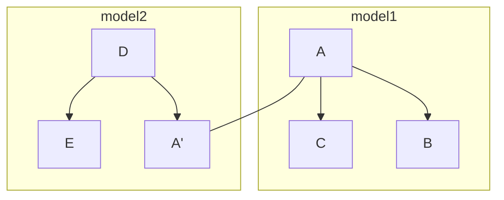

# 文本观察/复杂的GUI

原文：https://blog.royalsloth.eu/posts/the-complexity-that-lives-in-the-gui/

概括：GUI的复杂度来源于组件内部状态的互相干涉

作者举了个仓库管理界面的例子：

+ 一开始，面板左侧有用户头像与用户信息，面板右侧有存货清单，其他空位还有一些按钮负责登出系统、编辑/新增条目啥的。此时各组件状态独立，大家相安无事
+ 后来多了一个需求，在用户头像上有个小灯泡(旁边还有一行字"Working")，当用户正在编辑存货单时，该灯泡会亮起。这就涉及到组件状态的互相影响了。

有一些常用方法让复杂的状态互相干涉行为被组织得稍微有条理一点：

+ **1.Connect the boxes**: 假如有个组件A的状态会引发组件B的状态变化，那把B的实例当成参数传递给A, 让A内部在需要改变B状态时自行决断。
+ **2.Lift the state up**: 把A和B的内部状态提取到一个公共组件中(它一般被叫做Model), 但是其内部处理状态的逻辑还是可以留下来(不是标准的MVC)。
+ **3.Introduce a message bus**: 在软件内部开通一条组件间信道(我家连上信息高速路啦.jpg)，允许组件之间互相发送事件。

这三种方法各有其缺点和约束.

+ **对于1**

构造参数依赖于很多外部组件会让单元测试很难写，而且依赖的组件一多就需要各种依赖注入框架帮助，问题是这并没有在事实上减少需要考虑的组件，整个交互逻辑还是很难想，而且DI框架有时会神秘地随机崩溃，debug就更困难了。

+ **对于2**

依赖一多，维护一个有上百个组件状态的中控室还是会很困难。到处都有奇怪的边界条件分支(weird edge cases). 另外还是会有些奇怪的状况只在实际运行程序时才出现。

一种常见的改良是把某个大的model拆分成一组平行的Model，每个Model中存储相互依赖且概念上为一个整体的几个状态，并且保持公共状态同步。

(图是瞎画的，仅仅表示依赖关系)



比较现代的GUI框架常常提供某种双向绑定机制，允许用户更轻松地在model之间传播状态的改变。

更加泛化的想法是为状态对象追加一个监听器，在每次状态改变时执行对应操作。例如，有个用户希望在头像上的小灯亮时把编辑区背景变成红色

```javascript
this.lightTurnedOn.bind(this.editingInventoryTable);

this.lightTurnedOn.addListener((oldState, lightTurnedOn) -> {
    if (lightTurnedOn) {
        changeBackgroundToRed();
    } else {
        changeBackgroundToIbmGray();
    }
});
```

但这通常是对局面失去控制的开始。数据绑定(data binding)和改动监听器(change listener)常常引入隐藏的回环事件监听器(事件A改变状态B，状态B的改变触发事件A), 这样的问题在开发及code review时很难被发现。

+ **对于3**

它让debug变难了，事件又不会自带stacktrace，在一个大型系统里，想搞清楚某条消息的来源还真不好办。组件多了还会有性能问题。这时候又会有用户定义的频道(Channel)来救场(例如javascript的event emiter，此设计的关键是让组件可以"订阅"特定主题的事件，GUI框架里面通常会给这种机制起名叫event bus)。

# ImGUI

最简单的做法是把所有的状态装在一个全局容器里，让每个组件随便访问自己需要的状态。实际上，前端程序员已经这样做了，他们有Redux这样的状态容器库。直接使用hashmap会失去像time-travel debugging(状态容器会记录所有历史事件)这样的高级特性，但是代码很好理解用起来也简单。

游戏开发者们早就这样做了，他们管这个叫Immediate Mode, 他们的GUI组件不会慢慢等待事件到达。